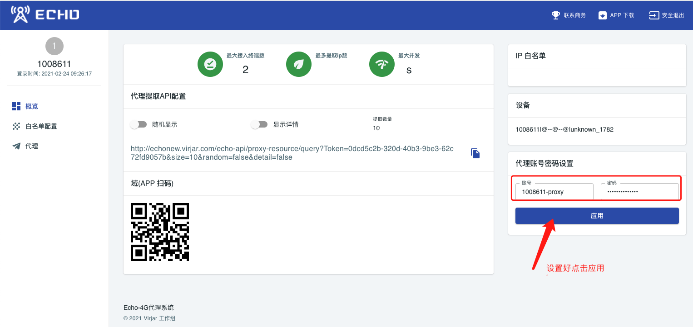
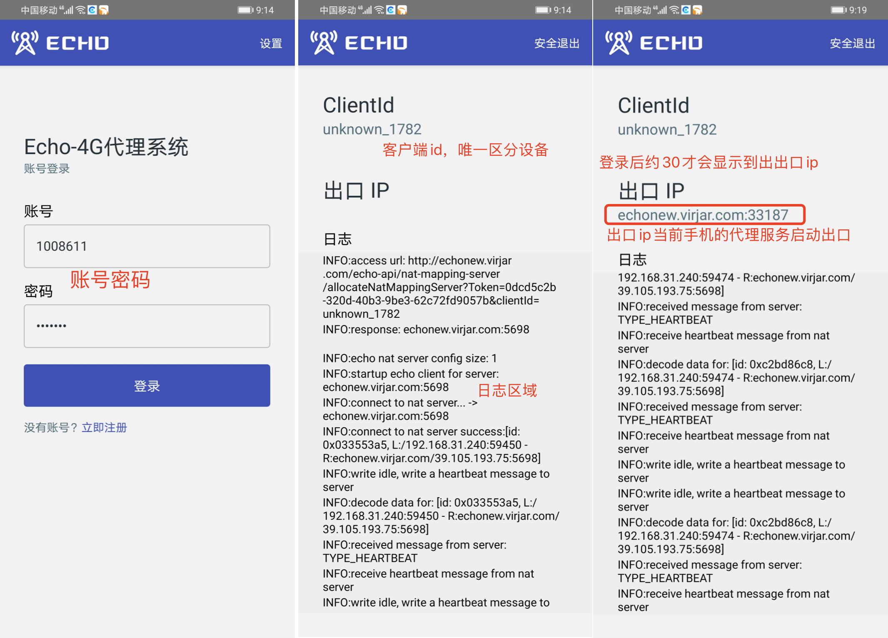
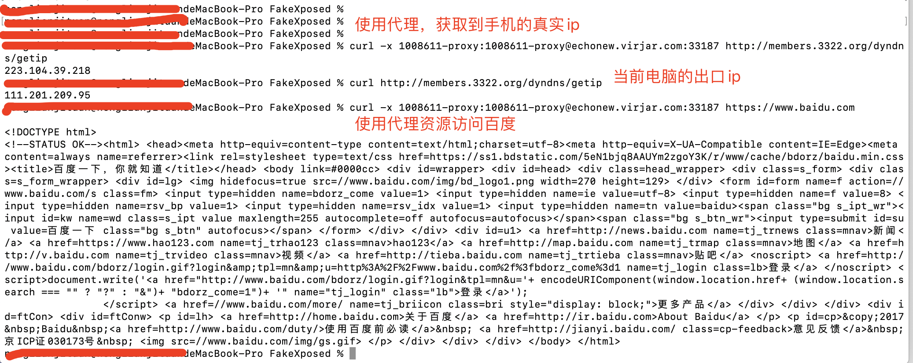

# 快速上手

我们用Android手机进行Echo快速上手功能演示

## 登录注册
echo的后台部署网址为： http://echonew.virjar.com/

登录注册流程很简单，首次登录系统进行注册即可


假定我注册了一个账户，1008611/1008611

## 配置代理账户
使用代理需要配置验证规则，也就是再给代理API创建一个代理使用的专用账户。我这里账户密码都设置为： 1008611-proxy


## 安装apk并登录app
在网址右上角导航栏中，可以看到apk的下载链接，和看到下载链接二维码


app安装到手机之后，使用刚刚注册的账号进行登录:

登录之后会出现上面图例，其中出口ip非常重要，他是一个可以正常使用的代理ip资源

可以看到，当前手机有了一个出口ip: echonew.virjar.com:3317

## 使用curl命令测试代理ip
如果你在Linux或者mac上面，可以在终端使用curl测试代理ip。如果你在windows，可以通过chrome插件:SwitchyOmega 进行代理ip测试

我们使用刚刚手机显示的出口IP：echonew.virjar.com:3317 进行代理ip测试。命令如下：
```
curl -x 1008611-proxy:1008611-proxy@echonew.virjar.com:33187 http://members.3322.org/dyndns/getip
```
其中 ``1008611-proxy:1008611-proxy``是我们刚刚在后台创建的代理专用账户密码,``echonew.virjar.com:33187``是手机的出口ip，``http://members.3322.org/dyndns/getip``是我们需要访问的网址，这个网址可以显示当前请求来自那个ip



可以明显看到，在使用代理前后，我们网站得到的出口ip不一样。一个是我的手机app的流量出口ip，一个是我电脑的宽带出口IP。同时app上面也可以同步看到访问百度的日志记录


这样，我们的快速体验就成功啦