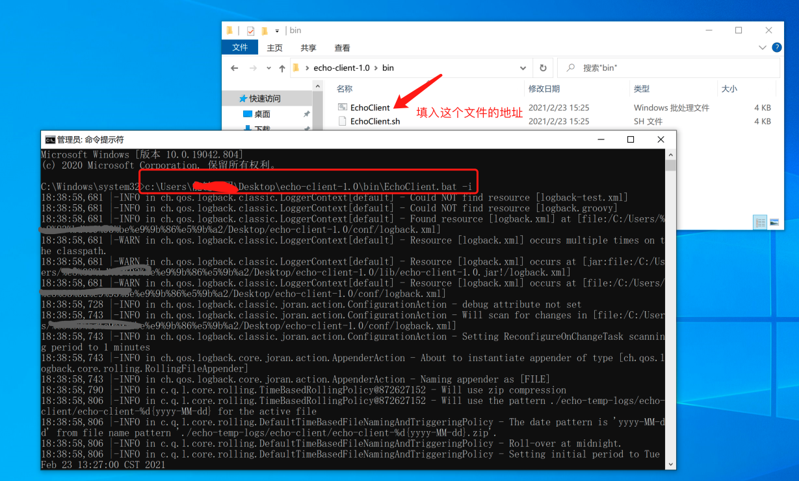
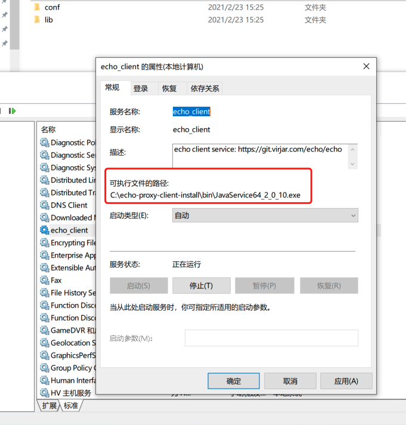
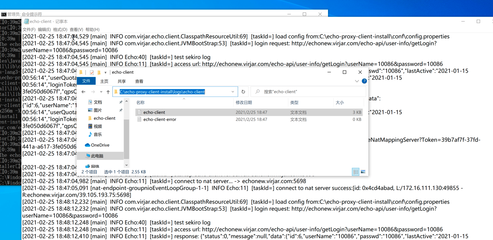

# 3 pc环境下的部署

在PC(Windows、MacOs、Linux)环境下，Echo提供了一套客户端脚本，使用他可以在PC环境中安装。共享PC主机的ip出口资源。

## 3.1 脚本下载地址

点击右侧超链接下载: [echo-client-1.0](asset/echo-client-1.0.zip)

## 3.2 项目结构说明

脚本为压缩包，解压之后可以看到如下的文件目录结构:

```
virjar@nvirjardeMacBook-Pro echo-client-1.0 % find .
.
./bin                                   ｜ 可执行脚本目录
./bin/EchoClient.sh                     ｜ linux/unix 启动引导文件
./bin/EchoClient.bat                    ｜ windows启动引导文件                  
./lib                                   ｜ lib库文件目录
./lib/netty-transport-4.0.44.Final.jar
./lib/fastjson-1.2.68.jar
./lib/netty-common-4.0.44.Final.jar
./lib/commons-cli-1.3.1.jar
./lib/slf4j-api-1.7.25.jar
./lib/logback-classic-1.2.3.jar
./lib/netty-codec-4.0.44.Final.jar
./lib/netty-buffer-4.0.44.Final.jar
./lib/echo-client-1.0.jar
./lib/commons-io-2.6.jar
./lib/logback-core-1.2.3.jar
./lib/jaxen-1.1.6.jar
./lib/echo-proxy-lib-1.4.jar
./lib/maven-metadata-appassembler.xml
./lib/dom4j-2.0.0.jar
./lib/netty-handler-4.0.44.Final.jar
./lib/commons-lang3-3.5.jar
./conf                                  ｜ 配置文件目录
./conf/logback.xml                      ｜ 日志规则配置：详细定制请参考logback配置规则
./conf/config.properties                ｜ echo配置项 ：为echo自定义配置点，具体参考3.4节配置内容讲述
virjar@virjardeMacBook-Pro echo-client-1.0 % 
```

## 3.3 脚本安装


安装方式很简单，在超级管理员状态下，执行特定引导脚本，并附加``-i``参数即可。不过首先脚本底层基于java语言，所以安装之前请先安装好jdk环境，java环境安装请自行百度查找
如MacOs和Linux:``sudo ./bin/EchoClient.sh  -i`` ，windows:``./bin/EchoClient.bat  -i``

```
virjar@virjardeMacBook-Pro echo-client-1.0 % ./bin/EchoClient.sh -i
18:09:22,482 |-INFO in ch.qos.logback.classic.LoggerContext[default] - Could NOT find resource [logback-test.xml]
18:09:22,482 |-INFO in ch.qos.logback.classic.LoggerContext[default] - Could NOT find resource [logback.groovy]
18:09:22,482 |-INFO in ch.qos.logback.classic.LoggerContext[default] - Found resource [logback.xml] at [file:/Users/virjar/Desktop/echo-client-1.0/conf/logback.xml]
18:09:22,483 |-WARN in ch.qos.logback.classic.LoggerContext[default] - Resource [logback.xml] occurs multiple times on the classpath.
18:09:22,483 |-WARN in ch.qos.logback.classic.LoggerContext[default] - Resource [logback.xml] occurs at [jar:file:/Users/virjar/Desktop/echo-client-1.0/lib/echo-client-1.0.jar!/logback.xml]
18:09:22,483 |-WARN in ch.qos.logback.classic.LoggerContext[default] - Resource [logback.xml] occurs at [file:/Users/virjar/Desktop/echo-client-1.0/conf/logback.xml]
18:09:22,532 |-INFO in ch.qos.logback.classic.joran.action.ConfigurationAction - debug attribute not set
18:09:22,535 |-INFO in ch.qos.logback.classic.joran.action.ConfigurationAction - Will scan for changes in [file:/Users/virjar/Desktop/echo-client-1.0/conf/logback.xml] 
18:09:22,535 |-INFO in ch.qos.logback.classic.joran.action.ConfigurationAction - Setting ReconfigureOnChangeTask scanning period to 1 minutes
18:09:22,538 |-INFO in ch.qos.logback.core.joran.action.AppenderAction - About to instantiate appender of type [ch.qos.logback.core.rolling.RollingFileAppender]
18:09:22,541 |-INFO in ch.qos.logback.core.joran.action.AppenderAction - Naming appender as [FILE]
18:09:22,572 |-INFO in c.q.l.core.rolling.TimeBasedRollingPolicy@1856426318 - Will use zip compression
18:09:22,573 |-INFO in c.q.l.core.rolling.TimeBasedRollingPolicy@1856426318 - Will use the pattern ./echo-temp-logs/echo-client/echo-client-%d{yyyy-MM-dd} for the active file
18:09:22,576 |-INFO in c.q.l.core.rolling.DefaultTimeBasedFileNamingAndTriggeringPolicy - The date pattern is 'yyyy-MM-dd' from file name pattern './echo-temp-logs/echo-client/echo-client-%d{yyyy-MM-dd}.zip'.
18:09:22,576 |-INFO in c.q.l.core.rolling.DefaultTimeBasedFileNamingAndTriggeringPolicy - Roll-over at midnight.
18:09:22,579 |-INFO in c.q.l.core.rolling.DefaultTimeBasedFileNamingAndTriggeringPolicy - Setting initial period to Thu Feb 25 18:09:22 CST 2021
18:09:22,579 |-INFO in ch.qos.logback.core.joran.action.NestedComplexPropertyIA - Assuming default type [ch.qos.logback.classic.encoder.PatternLayoutEncoder] for [encoder] property
18:09:22,596 |-INFO in ch.qos.logback.core.rolling.RollingFileAppender[FILE] - Active log file name: ./echo-temp-logs/echo-client/echo-client.log
18:09:22,596 |-INFO in ch.qos.logback.core.rolling.RollingFileAppender[FILE] - File property is set to [./echo-temp-logs/echo-client/echo-client.log]
18:09:22,597 |-INFO in ch.qos.logback.core.joran.action.AppenderAction - About to instantiate appender of type [ch.qos.logback.core.rolling.RollingFileAppender]
18:09:22,597 |-INFO in ch.qos.logback.core.joran.action.AppenderAction - Naming appender as [ERROR]
18:09:22,599 |-INFO in c.q.l.core.rolling.TimeBasedRollingPolicy@1792393294 - Will use zip compression
18:09:22,599 |-INFO in c.q.l.core.rolling.TimeBasedRollingPolicy@1792393294 - Will use the pattern ./echo-temp-logs/echo-client/echo-client-error-%d{yyyy-MM-dd} for the active file
18:09:22,600 |-INFO in c.q.l.core.rolling.DefaultTimeBasedFileNamingAndTriggeringPolicy - The date pattern is 'yyyy-MM-dd' from file name pattern './echo-temp-logs/echo-client/echo-client-error-%d{yyyy-MM-dd}.zip'.
18:09:22,600 |-INFO in c.q.l.core.rolling.DefaultTimeBasedFileNamingAndTriggeringPolicy - Roll-over at midnight.
18:09:22,600 |-INFO in c.q.l.core.rolling.DefaultTimeBasedFileNamingAndTriggeringPolicy - Setting initial period to Thu Feb 25 18:09:22 CST 2021
18:09:22,600 |-INFO in ch.qos.logback.core.joran.action.NestedComplexPropertyIA - Assuming default type [ch.qos.logback.classic.encoder.PatternLayoutEncoder] for [encoder] property
18:09:22,601 |-INFO in ch.qos.logback.core.rolling.RollingFileAppender[ERROR] - Active log file name: ./echo-temp-logs/echo-client/echo-client-error.log
18:09:22,601 |-INFO in ch.qos.logback.core.rolling.RollingFileAppender[ERROR] - File property is set to [./echo-temp-logs/echo-client/echo-client-error.log]
18:09:22,601 |-INFO in ch.qos.logback.core.joran.action.AppenderAction - About to instantiate appender of type [ch.qos.logback.core.ConsoleAppender]
18:09:22,602 |-INFO in ch.qos.logback.core.joran.action.AppenderAction - Naming appender as [STDOUT]
18:09:22,603 |-INFO in ch.qos.logback.core.joran.action.NestedComplexPropertyIA - Assuming default type [ch.qos.logback.classic.encoder.PatternLayoutEncoder] for [encoder] property
18:09:22,604 |-INFO in ch.qos.logback.classic.joran.action.LoggerAction - Setting level of logger [com.virjar.echo.client.installer] to INFO
18:09:22,604 |-INFO in ch.qos.logback.classic.joran.action.LoggerAction - Setting additivity of logger [com.virjar.echo.client.installer] to false
18:09:22,604 |-INFO in ch.qos.logback.core.joran.action.AppenderRefAction - Attaching appender named [STDOUT] to Logger[com.virjar.echo.client.installer]
18:09:22,605 |-INFO in ch.qos.logback.classic.joran.action.RootLoggerAction - Setting level of ROOT logger to INFO
18:09:22,605 |-INFO in ch.qos.logback.core.joran.action.AppenderRefAction - Attaching appender named [FILE] to Logger[ROOT]
18:09:22,605 |-INFO in ch.qos.logback.core.joran.action.AppenderRefAction - Attaching appender named [ERROR] to Logger[ROOT]
18:09:22,605 |-INFO in ch.qos.logback.classic.joran.action.ConfigurationAction - End of configuration.
18:09:22,605 |-INFO in ch.qos.logback.classic.joran.JoranConfigurator@6833ce2c - Registering current configuration as safe fallback point

2021-02-25 18:09:22 | INFO  | main | com.virjar.echo.client.installer.JvmClientInstaller | copy directory from :/Users/virjar/Desktop/echo-client-1.0 to:/Users/virjar/echo-proxy-client
2021-02-25 18:09:22 | INFO  | main | com.virjar.echo.client.installer.CmdExecutor | execute cmd: launchctl load /Users/virjar/Library/LaunchAgents/com.virjar.echo-client.plist
2021-02-25 18:09:23 | INFO  | main | com.virjar.echo.client.installer.CmdExecutor | cmd execute result:

2021-02-25 18:09:23 | INFO  | main | com.virjar.echo.client.installer.JvmClientInstaller | your echo client install successful in path: /Users/virjar/echo-proxy-client
virjar@virjardeMacBook-Pro echo-client-1.0 % 
```

同时，如果你在unix like系统上安装，可以使用如下懒人脚本（顺利的话可以一步到位):
```
curl -o echo-client.zip -L https://gitee.com/virjar/echo/raw/master/asset/echo-client-1.0.zip & unzip -d download-echo-client  echo-client.zip & sudo ./download-echo-client/bin/EchoClient.sh  -i
```

## 3.3.1 window脚本安装
其实windows和mac是一样的安装方法，不过windows需要用管理员身份运行脚本。所以这里带着图文演示一遍(注意这提前安装好了jdk)

首先，我们把echo脚本下载下来，并放到桌面:


点击桌面左下角菜单，搜索``cmd``，找到``命令提示符``,在命令提示符上面右键，选择以管理员身份运行


在命令行中，输入我们那个``EchoClient.bat``的文件路径，然后添加``-i``参数，回车运行即可


如果没有报错，windows的安装过程就完成了。接下来我们需要去windows的服务管理上面检查下状态，并且手动运行echo服务。

点击桌面左下角菜单，搜索``service``，找到``服务``，单击打开


在服务列表中找到``echo_client``,右键选择启动服务即可


在服务属性上面可以看到echo的安装位置,请注意，由于windows系统经常路径中带中文、带空格。在命令行操作的时候容易引发各种问题，所以我们这里把echo安装到某个磁盘的根目录。目录选择策略为: ``D:\echo-proxy-client-install\``->``E:\echo-proxy-client-install\`` -> ``F:\echo-proxy-client-install\`` -> ``%user_home%\echo-proxy-client-install`` 


所以安装好之后，可以在安装目录找到echoclient的运行日志：



到此位置，windows的自动安装就完成了。

## 3.4 config.properties

客户端有配置文件，配置文件主要配置各种运行参数。但是当前配置项不多。

```
# 这是接入终点，如果你没有购买私有化部署服务，那么这个地址不需要修改。否则将会指向你们私有化部署的API地址
api-entry=http://echonew.virjar.com/  

# 客户端id，Echo服务通过 client-id来区分各个终端，这个可以配置为空，大部分情况下也可以为空。EchoClient默认会解析网卡地址作为clientId。不过在设备调试的时候，可以通过配置一个特定的clientId用于观察日志
client-id=

# 你在echo系统的账户
echo-account=10086

# 你在echo系统的密码
echo-password=10086

```

配置文件修改一般需要在下载之后，提前编译。之后再通过脚本安装。如果在安装之后想修改配置，那么可以先停止服务、然后到echo安装目录找到配置文件。修改完成之后重启服务即可
